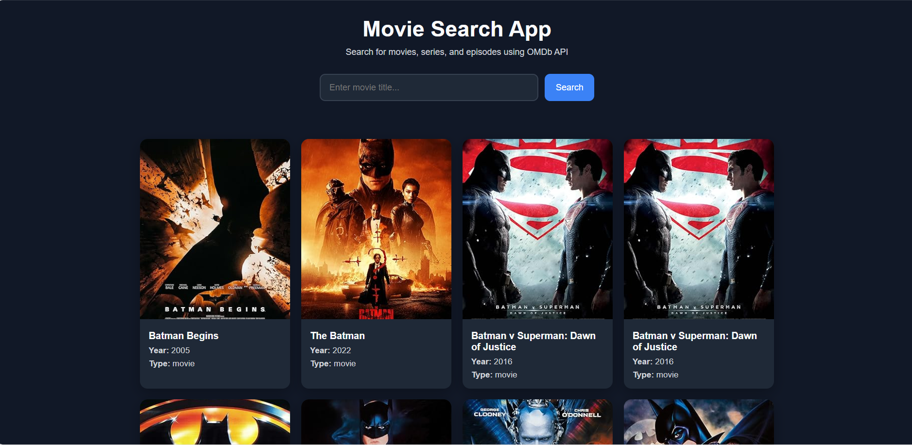

# Movie Search App

Movie search application with HTML, CSS, JavaScript, and OMDb API.

## Features

- Search movies by little
- Display movie posters, titles, years, and types
- Responsive card layout
- Loading state while fetching data
- Error handling for empty input
- Error handling for no results
- Clean and responsive UI

## Technologies

- HTML
- CSS
- JavaScript
- OMDb API

## Project Goal

This project was created to practice working with APIs, asynchronous JavaScript, DOM manipulation, and dynamic rendering of data from external sources.

## How to Use

1. Enter a movie title in the search field
2. Click the search button
3. Browse the results

## Live Demo

[Open Movie Search App](https://movie-search-app-archyteam.netlify.app)

## Screenshot

